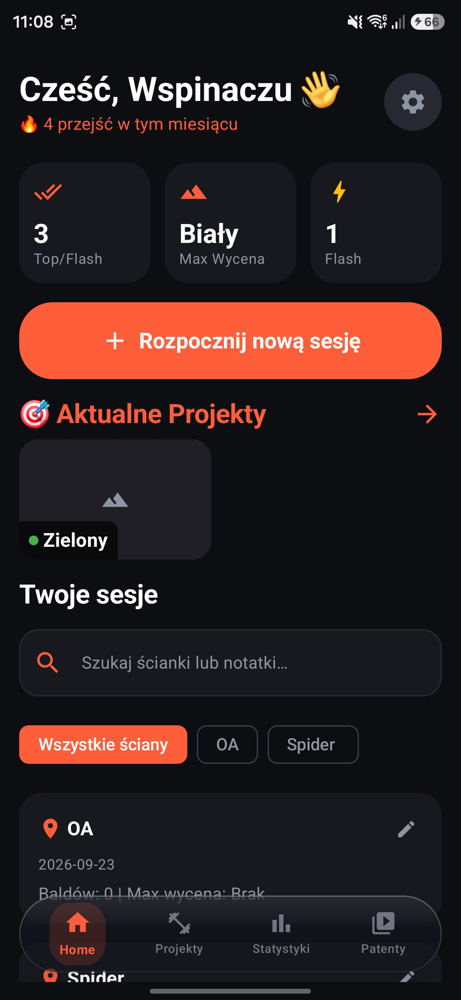
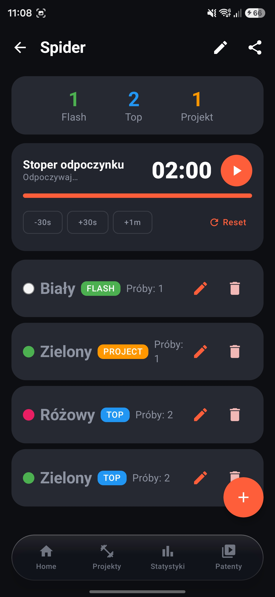
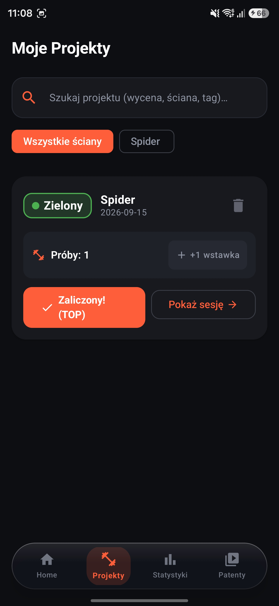
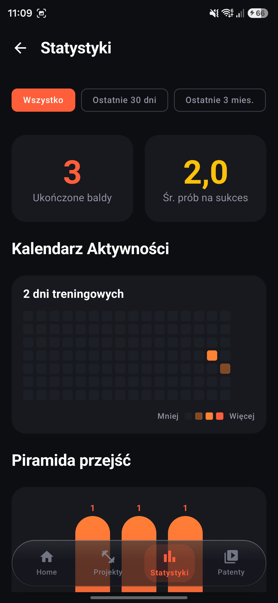

# BoulderTrack

Aplikacja na system Android służąca do rejestrowania treningów boulderingowych, śledzenia projektów oraz analizy postępów wspinaczkowych. Zbudowana w technologii Jetpack Compose z wykorzystaniem architektury Clean Architecture, wzorca MVVM oraz lokalnej bazy danych SQLDelight.

---

## Zrzuty ekranu

| Ekran główny | Szczegóły sesji | Projekty | Statystyki |
| :---: | :---: | :---: | :---: |
|  |  |  |  |

---

## Funkcjonalności

### Dziennik treningowy
- Tworzenie, edycja i usuwanie sesji wspinaczkowych.
- Autouzupełnianie nazw ścian wspinaczkowych na podstawie historii.
- Wybór daty treningu za pomocą systemowego kalendarza (DatePickerDialog).
- Rejestrowanie pokonanych boulderów z określeniem:
  - wyceny trudności,
  - stylu przejścia (Flash, Top, Projekt),
  - liczby prób (wstawek),
  - tagów formacji i chwytów (krawądki, oblaki, dach, połóg, rysa, skok),
  - notatek technicznych,
  - załączników w postaci zdjęć i nagrań wideo.
- Pełna edycja parametrów zapisanego bouldera.
- Udostępnianie podsumowania sesji w formie tekstowej do schowka lub zewnętrznych aplikacji.

### Skale trudności
Aplikacja obsługuje cztery systemy wyceniania dróg:
- **Fontainebleau (Font):** od 4 do 8c (standard europejski).
- **V-Scale (Hueco):** od VB do V15 (standard amerykański).
- **Kolory ściankowe:** gradacja obwodów (zielony, różowy, biały, żółty, pomarańczowy, czerwony, fioletowy, niebieski, czarny).
- **Skala numeryczna:** uproszczona skala w zakresie 1–10.
- Możliwość ustawienia preferowanej domyślnej skali w ustawieniach aplikacji.

### Zarządzanie projektami
- Dedykowany widok agregujący wszystkie otwarte projekty ze wszystkich sesji.
- Szybkie naliczanie kolejnych prób (+1 wstawka) z poziomu listy.
- Bezpośrednie oznaczanie projektu jako ukończony (TOP).
- Wyszukiwanie oraz filtrowanie projektów według wyceny, tagów lub lokalizacji.
- Opcja bezpośredniego przejścia do sesji powiązanej z danym projektem.

### Stoper odpoczynku
- Zintegrowany licznik czasu odpoczynku między próbami.
- Działanie w oparciu o usługę pierwszoplanową (Foreground Service), zapobiegające zatrzymaniu odliczania po zablokowaniu ekranu lub przełączeniu aplikacji.
- Powiadomienie systemowe z przyciskami szybkiej kontroli: Pauza, Wznów, +30s oraz Reset.

### Statystyki i analityka
- Piramida wycen prezentująca rozkład pokonanych boulderów.
- Zestawienie skuteczności przejść z podziałem procentowym i liczbowym na style Flash, Top oraz Projekt.
- Filtrowanie danych według okresów: ostatnie 30 dni, ostatnie 90 dni, bieżący rok lub cała historia.
- Kalendarz aktywności (mapa aktywności treningowej) z podsumowaniem liczby dni treningowych i aktualnej passy.

### Baza patentów (Beta Library)
- Przegląd multimediów (zdjęcia, wideo) przypisanych do dróg wspinaczkowych.
- Pełnoekranowa przeglądarka z obsługą gestów przybliżania (pinch-to-zoom).

### Interfejs i personalizacja
- Pływający dolny pasek nawigacyjny z animacjami przejść między zakładkami.
- Obsługa czterech wariantów motywu graficznego: Jasny, Ciemny, Systemowy oraz AMOLED (czysta czerń dla ekranów OLED).
- Dwujęzyczny interfejs: język polski oraz język angielski.

---

## Architektura i technologie

Aplikacja została zaprojektowana zgodnie z wytycznymi Clean Architecture oraz wzorcem MVVM:

```
app/
 ├── data/            # Źródła danych, implementacja repozytoriów, mapery SQLDelight
 ├── domain/          # Modele biznesowe, interfejsy repozytoriów, menedżery logiki
 ├── presentation/    # ViewModele zarządzające stanem UI (StateFlow)
 └── ui/              # Komponenty interfejsu użytkownika w Jetpack Compose
```

### Stos technologiczny:
- **UI:** Jetpack Compose, Material 3, Navigation Compose
- **Baza danych:** SQLDelight (lokalna baza SQLite z bezpiecznymi typowo zapytaniami)
- **Dependency Injection:** Koin
- **Asynchroniczność:** Kotlin Coroutines, StateFlow / Flow
- **Obsługa dat:** kotlinx-datetime
- **Obsługa obrazów:** Coil Compose
- **Usługi systemowe:** Android Foreground Service, NotificationCompat

---

## Wymagania i uruchomienie

### Wymagania wstępne
- **Android Studio:** Ladybug (2024.2.1) / Koala / Iguana lub nowszy
- **Java Development Kit (JDK):** JDK 17 lub JDK 21
- **Android SDK:** Compile SDK 35 (Android 15), Min SDK 24 (Android 7.0)

---

### Uruchomienie i emulacja w Android Studio (zalecane)

1. **Klonowanie i import projektu:**
   - Sklonuj repozytorium:
     ```bash
     git clone https://github.com/addrumer/BoulderTrack.git
     ```
   - Otwórz Android Studio, wybierz opcję **File -> Open** i wskaż katalog projektu `BoulderTrack`.
   - Poczekaj na zakończenie automatycznej synchronizacji zależności (`Gradle Sync`).

2. **Przygotowanie emulatora (Android Virtual Device - AVD):**
   - Otwórz menedżer urządzeń w Android Studio: **Tools -> Device Manager** (lub kliknij ikonę telefonu na prawym pasku bocznym).
   - Kliknij przycisk **Create Device**.
   - Wybierz urządzenie referencyjne (np. **Pixel 8** lub **Pixel 7**).
   - W kroku *System Image* wybierz i pobierz obraz z API 34 lub API 35 (zalecana architektura: `x86_64` z obsługą Google Play / Google APIs).
   - Kliknij **Finish**, aby utworzyć wirtualne urządzenie.
   - Uruchom emulator, klikając ikonę **Play** przy utworzonym urządzeniu na liście AVD.

3. **Budowanie i uruchomienie aplikacji:**
   - Na górnym pasku narzędzi upewnij się, że wybrany jest moduł uruchomieniowy `app` oraz Twój uruchomiony emulator z listy urządzeń.
   - Kliknij przycisk **Run 'app'** (zielony trójkąt) lub użyj skrótu klawiszowego `Shift + F10`.
   - Projekt zostanie skompilowany, spakowany do APK, zainstalowany i automatycznie otwarty na ekranie emulatora.

---

### Uruchomienie i emulacja z wiersza poleceń (CLI)

Wymagane jest, aby narzędzia Android SDK (`emulator`, `platform-tools` z narzędziem `adb`) były dodane do zmiennej środowiskowej `PATH`.

1. **Uruchomienie emulatora z konsoli:**
   ```bash
   # Wyświetlenie listy zainstalowanych emulatorów
   emulator -list-avds

   # Uruchomienie wybranego emulatora
   emulator -avd <NAZWA_EMULATORA>
   ```

2. **Weryfikacja dostępności urządzenia:**
   ```bash
   adb devices
   ```

3. **Kompilacja i bezpośrednia instalacja na aktywnym emulatorze:**
   ```bash
   # Linux / macOS:
   ./gradlew installDebug

   # Windows (PowerShell / CMD):
   .\gradlew.bat installDebug
   ```

4. **Uruchomienie zainstalowanej aplikacji na emulatorze przez ADB:**
   ```bash
   adb shell am start -n com.example.bouldertrack/.MainActivity
   ```

---

### Przydatne polecenia Gradle

```bash
# Uruchomienie testów jednostkowych
./gradlew testDebugUnitTest

# Zbudowanie instalacyjnego pliku APK (debug)
./gradlew assembleDebug

# Czyszczenie i ponowna kompilacja projektu
./gradlew clean build
```

Plik wynikowy APK po kompilacji znajduje się w ścieżce:
`app/build/outputs/apk/debug/app-debug.apk`